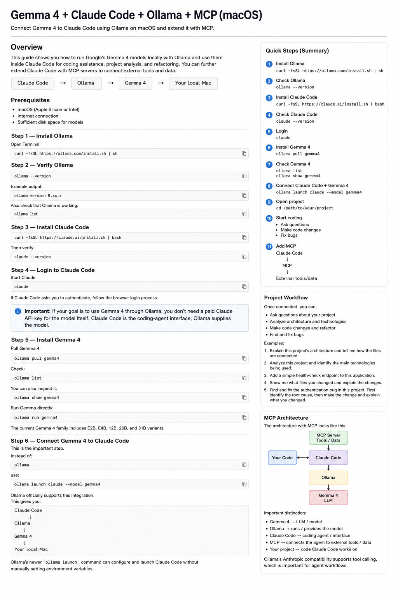
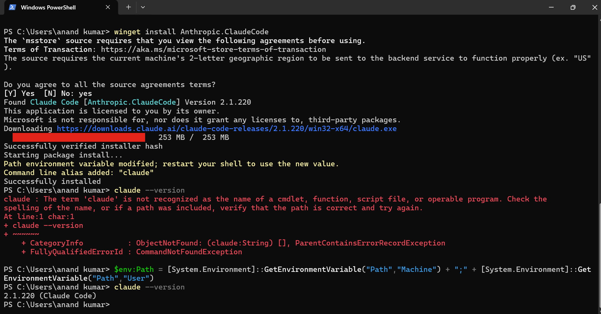
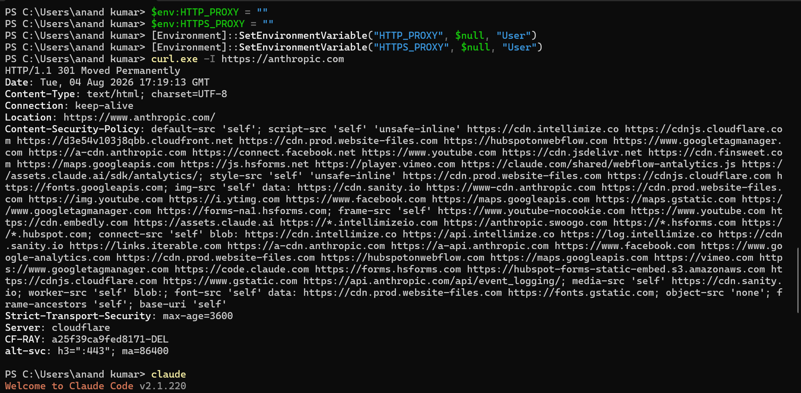
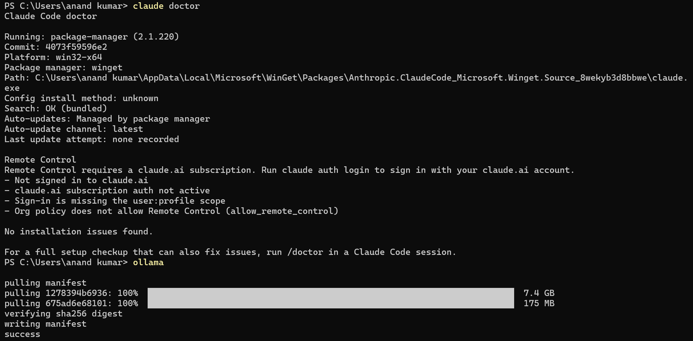
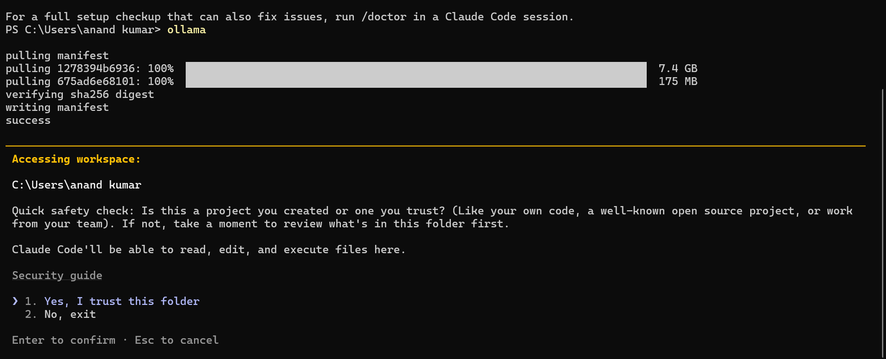
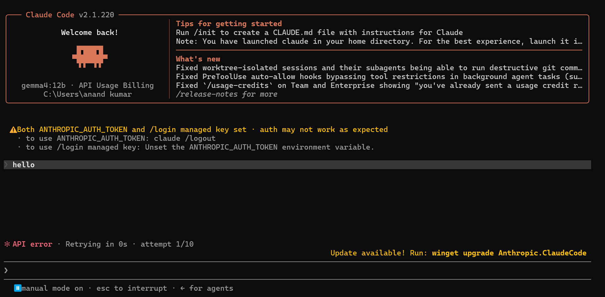
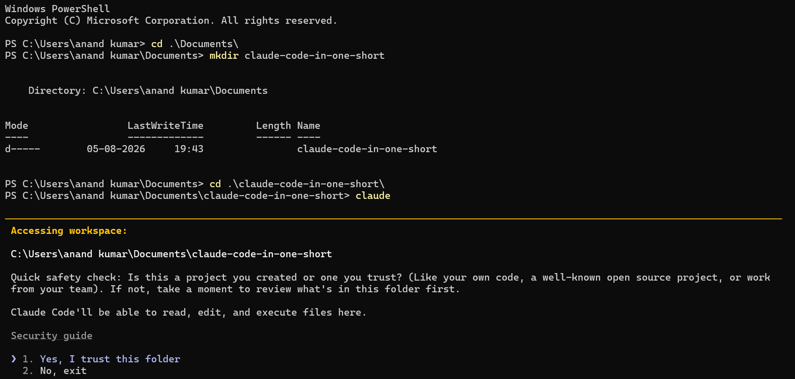
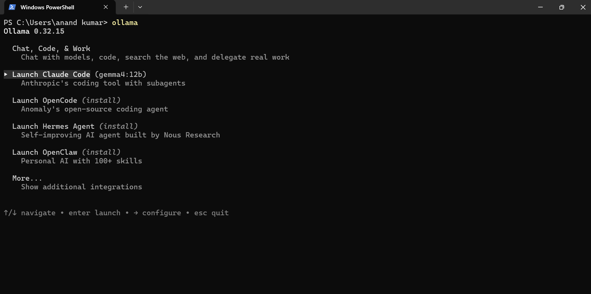
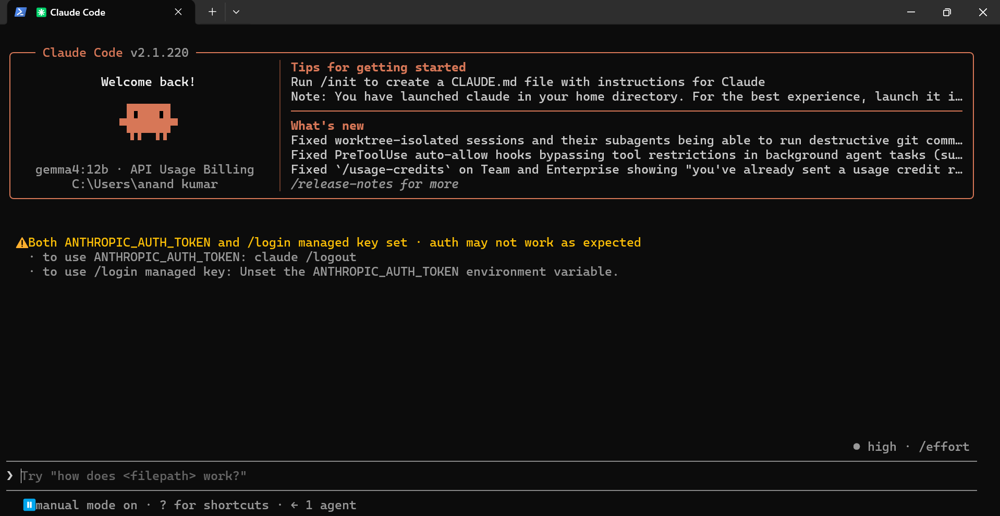

# Gemma 4 + Claude Code + Ollama + MCP (macOS)

Connect Gemma 4 to Claude Code using Ollama on macOS and extend the setup with MCP.

## Overview

This guide shows how to run Gemma 4 locally with Ollama and use it through Claude Code for coding assistance, project analysis, refactoring, and debugging. You can also extend Claude Code with MCP servers to connect external tools and data.

```text
Claude Code
     ↓
  Ollama
     ↓
  Gemma 4
     ↓
Your local Mac
```

## Prerequisites

- macOS (Apple Silicon or Intel)
- Internet connection
- Sufficient disk space and RAM for the Gemma 4 model you choose
- Terminal access

---

## Step 1 — Install Ollama

Open **Terminal** and run:

```bash
curl -fsSL https://ollama.com/install.sh | sh
```

Ollama provides this installation command for macOS and supported systems.

---

## Step 2 — Verify Ollama

Check the installed version:

```bash
ollama --version
```

Example:

```text
ollama version 0.xx.x
```

Also verify that Ollama is working:

```bash
ollama list
```

If Ollama is installed correctly, the command should return your locally available models.

---

## Step 3 — Install Claude Code

Install Claude Code:

```bash
curl -fsSL https://claude.ai/install.sh | bash
```

Then verify the installation:

```bash
claude --version
```

---

## Step 4 — Log in to Claude Code

Start Claude Code:

```bash
claude
```

If Claude Code asks you to authenticate, follow the browser login process.

> **Important:** If your goal is to use Gemma 4 through Ollama, Ollama supplies the local model. Claude Code is the coding-agent interface. Authentication requirements can depend on the Claude Code/Ollama integration and the features you use.

---

## Step 5 — Install Gemma 4

Pull Gemma 4 with Ollama:

```bash
ollama pull gemma4
```

Check that the model is installed:

```bash
ollama list
```

Inspect the model:

```bash
ollama show gemma4
```

You can also run Gemma directly:

```bash
ollama run gemma4
```

The Gemma 4 family includes multiple model sizes, including E2B, E4B, 12B, 26B, and 31B variants. Choose a size appropriate for your Mac's available memory and performance requirements.

---

## Step 6 — Connect Gemma 4 to Claude Code

This is the key step.

Use Ollama's Claude Code launcher:

```bash
ollama launch claude --model gemma4
```

The resulting workflow is:

```text
┌──────────────┐
│ Claude Code  │
└──────┬───────┘
       │
       ▼
┌──────────────┐
│    Ollama    │
└──────┬───────┘
       │
       ▼
┌──────────────┐
│   Gemma 4    │
│     LLM      │
└──────┬───────┘
       │
       ▼
┌──────────────┐
│   Your Mac   │
└──────────────┘
```

Ollama's `ollama launch` command is intended to configure and launch supported coding agents with Ollama without requiring you to manually configure the model endpoint.

---

## Step 7 — Start Your Project

Change to your project directory:

```bash
cd /path/to/your/project
```

For example:

```bash
cd ~/Desktop/my-project
```

Then launch Claude Code with Gemma 4:

```bash
ollama launch claude --model gemma4
```

Claude Code can now work with the files in the project through the configured Ollama/Gemma 4 setup.

---

## Step 8 — Ask Your First Question

Try a project-analysis prompt:

```text
Explain this project's architecture and tell me how the files are connected.
```

Or:

```text
Analyze this project and identify the main technologies being used.
```

---

## Step 9 — Make Your First Code Change

For example:

```text
Add a simple health-check endpoint to this application.
```

After the change, ask:

```text
Show me what files you changed and explain the changes.
```

This is a useful way to review what the coding agent modified.

---

## Step 10 — Fix a Bug

For example:

```text
Find and fix the authentication bug in this project. First identify the root cause, then make the change and explain what you changed.
```

For important projects, review the proposed changes and run the project's tests before committing them.

---

# Step 11 — Add MCP

Once the Claude Code + Ollama + Gemma 4 setup is working, you can add **MCP (Model Context Protocol)** servers to provide additional tools and data sources.

The architecture becomes:

```text
                    ┌───────────────────┐
                    │    MCP Server     │
                    │   Tools / Data    │
                    └─────────┬─────────┘
                              │
                              ▼
┌──────────────┐       ┌──────────────┐
│   Your Code  │◄─────►│ Claude Code  │
└──────────────┘       └──────┬───────┘
                              │
                              ▼
                        ┌───────────┐
                        │  Ollama   │
                        └─────┬─────┘
                              │
                              ▼
                        ┌───────────┐
                        │  Gemma 4  │
                        │    LLM    │
                        └───────────┘
```

### What each component does

| Component | Role |
|---|---|
| **Gemma 4** | The LLM/model that generates and reasons about responses |
| **Ollama** | Runs the local model and provides the model interface |
| **Claude Code** | Coding agent/interface that works with your project |
| **MCP** | Connects the agent to external tools and data |
| **Your project** | The codebase Claude Code works on |

### Important distinction

**MCP is not the LLM.**

MCP provides tools and data to the agent. Gemma 4 is the model. Ollama runs and exposes the model, while Claude Code provides the coding-agent workflow.

Ollama's Anthropic-compatible interface supports tool calling, which is important for agent workflows involving tools.

---

## Example Project Workflow

Once the integration is working, you can use Claude Code for tasks such as:

### Understand a project

```text
Explain this project's architecture and tell me how the files are connected.
```

### Identify technologies

```text
Analyze this project and identify the main technologies being used.
```

### Add functionality

```text
Add a simple health-check endpoint to this application.
```

### Review changes

```text
Show me what files you changed and explain the changes.
```

### Debug

```text
Find and fix the authentication bug in this project. First identify the root cause, then make the change and explain what you changed.
```

---

## Troubleshooting Checklist

If the integration does not work as expected, check the following:

```bash
# Check Ollama
ollama --version
ollama list

# Check Gemma 4
ollama show gemma4

# Check Claude Code
claude --version

# Test Gemma directly
ollama run gemma4
```

Then try launching Claude Code again:

```bash
ollama launch claude --model gemma4
```

If a command fails, check the installed Ollama and Claude Code versions and consult their current documentation for integration-specific requirements.

---

## Quick Setup

```text
MACOS SETUP
│
├── 1. Install Ollama
│      curl -fsSL https://ollama.com/install.sh | sh
│
├── 2. Check Ollama
│      ollama --version
│      ollama list
│
├── 3. Install Claude Code
│      curl -fsSL https://claude.ai/install.sh | bash
│
├── 4. Check Claude Code
│      claude --version
│
├── 5. Authenticate if prompted
│      claude
│
├── 6. Install Gemma 4
│      ollama pull gemma4
│
├── 7. Check Gemma 4
│      ollama list
│      ollama show gemma4
│
├── 8. Connect Claude Code + Gemma 4
│      ollama launch claude --model gemma4
│
├── 9. Open your project
│      cd /path/to/your/project
│
├── 10. Start coding
│      Ask questions
│      Make code changes
│      Fix bugs
│
└── 11. Add MCP
       Claude Code
            ↓
           MCP
            ↓
       External tools/data
```

## Final Command Summary

The essential commands are:

```bash
# Install Ollama
curl -fsSL https://ollama.com/install.sh | sh

# Verify Ollama
ollama --version
ollama list

# Install Claude Code
curl -fsSL https://claude.ai/install.sh | bash

# Verify Claude Code
claude --version

# Authenticate if prompted
claude

# Install Gemma 4
ollama pull gemma4

# Inspect Gemma 4
ollama list
ollama show gemma4

# Enter your project
cd /path/to/your/project

# Launch Claude Code with Gemma 4
ollama launch claude --model gemma4
```

> **Key point:** The documented Ollama → Claude Code → Gemma 4 path is centered on:
>
> ```bash
> ollama pull gemma4
> ollama launch claude --model gemma4
> ```
>
> Use the first command to make the model available locally and the second to launch the Claude Code integration with Gemma 4.

